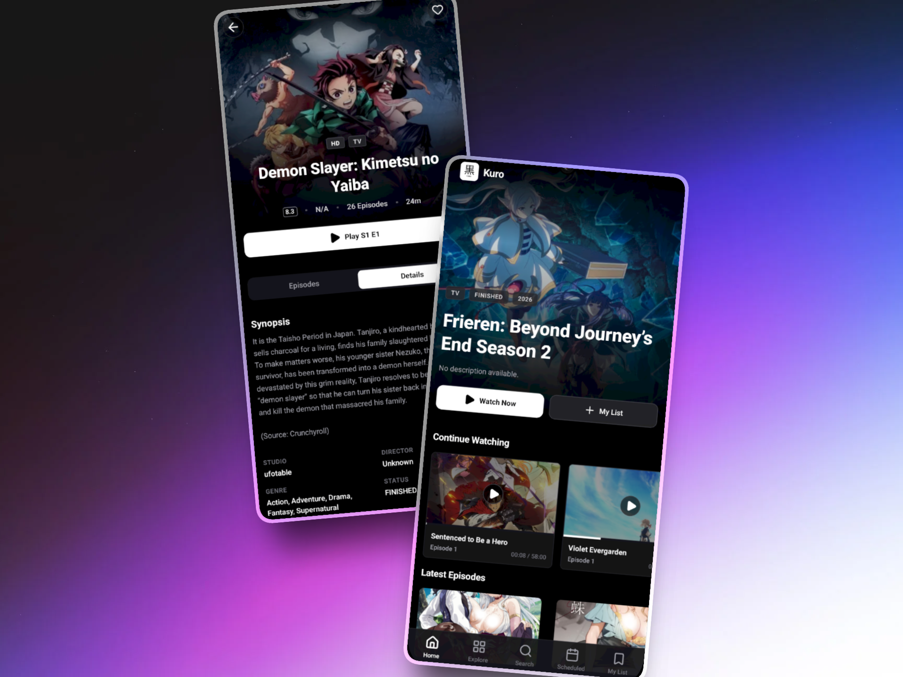
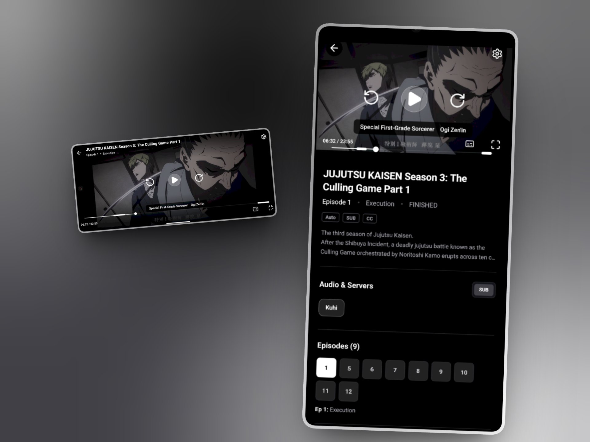

# Kuro

Kuro is a high-performance, modern anime streaming application built with React Native and Expo. It provides a seamless experience for discovering, tracking, and watching anime content with a focus on speed and visual excellence.

## Preview

<div align="center">
  
  
</div>

## API Integration Note

This application currently utilizes a free public instance of the backend API hosted at:
https://anime-api-y650.onrender.com

The source code for this API can be found at: 
[GitHub: aryaniiil/anime-api](https://github.com/aryaniiil/anime-api)

Please be advised that the public instance is subject to rate limiting and cold-starts. For production use or a more reliable experience, it is strongly recommended to host your own instance of the API following the documentation in the repository linked above.

## Features

### Discovery and Exploration
- Dynamic home screen featuring spotlight carousels, trending titles, and recent releases.
- Advanced exploration through genre-based filtering and global search.
- Segmented rankings for Top Upcoming, Top Airing, and Most Popular titles.

### Advanced Video Player
- HLS (M3U8) streaming support via expo-video.
- Dynamic quality switching (Auto, 1080p, 720p, 480p, 360p).
- Robust subtitle engine supporting VTT formats with custom overlay rendering.
- Playback speed controls ranging from 0.5x to 2.0x.
- Responsive orientation handling with seamless landscape transitions.
- Integrated intro and outro skip functionality.

### User Management and Tracking
- Localized watch history tracking for immediate resume from last playback position.
- Saved list functionality to bookmark anime for later viewing.
- Persistent data storage using asynchronous local storage modules.

## Getting Started

### Prerequisites
- Node.js (Latest LTS)
- Expo Go (for mobile testing) or a local emulator (Android Studio / Xcode)

### Installation
1. Clone the repository:
   ```bash
   git clone https://github.com/your-username/kuro.git
   ```
2. Install dependencies:
   ```bash
   npm install
   ```
3. Start the development server:
   ```bash
   npx expo start
   ```

## Technology Stack
- **Framework**: React Native with Expo (Managed Workflow)
- **Navigation**: Expo Router (File-based routing)
- **Styling**: NativeWind (Tailwind CSS for React Native)
- **Video Handling**: expo-video
- **Icons**: lucide-react-native
- **Storage**: @react-native-async-storage/async-storage

## License
Refer to the LICENSE file for details on project usage and distribution.
